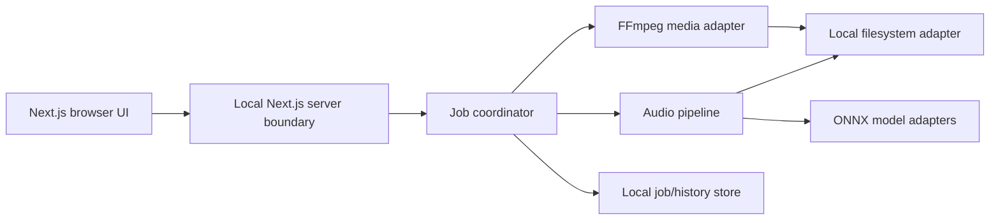
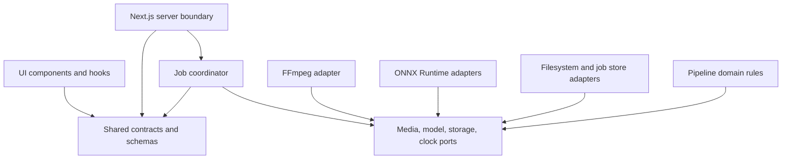
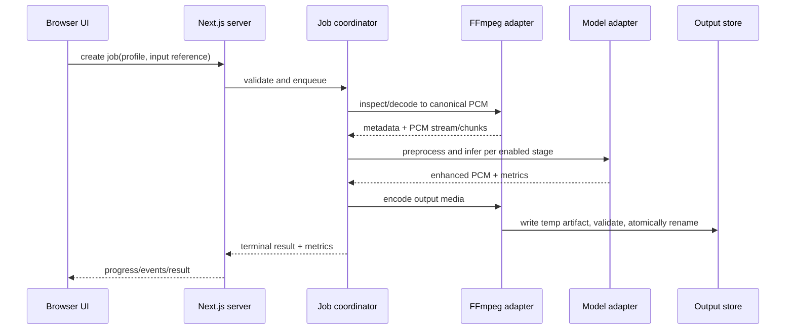

# Architecture Spine — AI Noise Removal

## Design Paradigm

Use a **layered, ports-and-adapters pipeline** with asynchronous local jobs.



The UI depends only on typed API contracts. The job coordinator owns lifecycle and cancellation. Media and model implementations are replaceable adapters. No layer may bypass the owner of a shared concern.

## Invariants & Rules

### AD-1 — Local-only processing boundary [ADOPTED]

- **Binds:** all application capabilities
- **Prevents:** accidental upload of media, telemetry containing media content, or cloud-dependent processing
- **Rule:** media bytes, decoded audio, model inputs, temporary files, outputs, job history, and logs remain on the laptop. Network access is not required for a processing run.

### AD-2 — Originals are immutable [ADOPTED]

- **Binds:** input, output, retry, and history flows
- **Prevents:** destructive edits and unrecoverable user data loss
- **Rule:** every run reads the source and writes a new output through an atomic temporary-file-then-rename flow. The source path is never an output target.

### AD-3 — Jobs are the unit of work [ADOPTED]

- **Binds:** processing, progress, cancellation, retry, and UI state
- **Prevents:** blocking HTTP requests, duplicated work, ambiguous partial results, and UI state that disagrees with the worker
- **Rule:** every run has a typed job ID, immutable input metadata, a normalized processing profile, explicit states (`queued`, `running`, `cancelling`, `cancelled`, `succeeded`, `failed`), progress events, and a terminal result.

### AD-4 — Pipelines are ordered and independently switchable [ADOPTED]

- **Binds:** noise removal, voice clarity, loudness, echo/reverb, enhancement, and future music/mixed-audio stages
- **Prevents:** hidden coupling between effects and inconsistent processing order
- **Rule:** the coordinator executes a validated ordered pipeline of named stages. Each stage declares input/output format, parameters, capability requirements, and whether it supports cancellation. Disabled stages are omitted; defaults must be explicit and reviewable.

### AD-5 — Media handling is adapter-owned [ADOPTED]

- **Binds:** MP3, WAV, M4A, FLAC, MP4, MOV, MKV, and future formats
- **Prevents:** format-specific logic leaking into UI or AI code
- **Rule:** FFmpeg is the only media demux/decode/encode boundary. The internal audio pipeline operates on a canonical PCM representation and returns an encoded artifact according to an explicit output profile.

### AD-6 — AI inference is behind model ports [ADOPTED]

- **Binds:** ONNX Runtime and future denoising/enhancement models
- **Prevents:** model-specific tensor shapes, sample rates, and runtime assumptions spreading through the application
- **Rule:** each model adapter owns preprocessing, tensor mapping, inference-provider selection, postprocessing, model version, and quality metadata. CPU execution is always supported; acceleration is optional and capability-detected.

### AD-7 — Typed contracts cross every boundary [ADOPTED]

- **Binds:** browser/server, job coordinator, pipeline stages, persistence, and errors
- **Prevents:** frontend/backend drift and untestable implicit payloads
- **Rule:** shared TypeScript schemas define media metadata, processing profiles, job events, terminal results, capabilities, and error envelopes. Runtime validation occurs at API and persistence boundaries.

### AD-8 — UI previews never substitute for final output [ADOPTED]

- **Binds:** before/after preview and output generation
- **Prevents:** the user mistaking a lossy preview or incomplete stream for the exported file
- **Rule:** preview uses a bounded derived artifact, is labeled as preview, and shares the same profile and stage ordering as the final job. Success means the final artifact passes media validation.

### AD-9 — Operational recovery is explicit [ADOPTED]

- **Binds:** cancellation, retry, crashes, disk errors, and history
- **Prevents:** corrupt files, orphaned temporary data, and jobs stuck forever in `running`
- **Rule:** temporary files are isolated and cleaned on startup and terminal completion. Cancellation is cooperative and leaves no successful output. Retry creates a new attempt linked to the original job. Startup reconciles interrupted jobs to `failed` or `cancelled` with a recoverable reason.

### AD-10 — Privacy and safety are visible in the product [ADOPTED]

- **Binds:** onboarding, settings, errors, and output handling
- **Prevents:** unclear trust boundaries and unsafe defaults
- **Rule:** the UI states that processing is local, displays model and FFmpeg versions/licenses, warns before overwriting a manually selected existing output, checks writable storage and available space, and provides clear cleanup controls.

### AD-11 — Cross-platform behavior is capability-driven [ADOPTED]

- **Binds:** Windows, macOS, and Linux support
- **Prevents:** platform-specific assumptions breaking setup or processing
- **Rule:** startup detects OS, architecture, available accelerators, FFmpeg/model availability, path permissions, and browser capabilities. Features are enabled only when supported and otherwise degrade to a documented CPU-safe path.

### AD-12 — One repository, one local product boundary [ADOPTED]

- **Binds:** source layout, setup, testing, and release
- **Prevents:** the UI and processing service evolving as unrelated products
- **Rule:** the web app, server routes, worker, shared contracts, model adapters, scripts, and documentation live in one repository with one documented setup and run path. A separate service is introduced only when profiling proves the in-process worker insufficient.

### Dependency direction



UI code may not import FFmpeg, ONNX Runtime, or filesystem primitives. Adapters may not import UI code. Domain rules depend on ports, not concrete tools.

## Consistency Conventions

| Concern | Convention |
| --- | --- |
| Naming | `camelCase` TypeScript fields; `PascalCase` types/components; kebab-case routes; `JobId`, `RunId`, and `ModelId` are branded string types. |
| Data and formats | ISO timestamps; bytes and durations are numeric; audio sample rate/channel layout are explicit; API responses use `{ data, error, requestId }` envelopes. |
| Errors | Stable error codes (`UNSUPPORTED_MEDIA`, `MODEL_UNAVAILABLE`, `DISK_SPACE_LOW`, `CANCELLED`, `PROCESSING_FAILED`) plus user-safe message and diagnostic context. |
| State mutation | The job coordinator is the only writer of job state; the history store is append/update through coordinator commands. |
| Logging | Structured local logs with request/job IDs; never log media bytes, raw audio, full file contents, or secrets. |
| Configuration | Environment/config files hold paths and tunables only; no user media or model secrets. Defaults are safe and documented. |
| Testing | Unit-test stage contracts and state transitions; integration-test FFmpeg/model adapters with fixtures; end-to-end test the complete local flow. |
| Accessibility | Keyboard operability, visible focus, labels for every control, color-independent status, reduced motion, and screen-reader announcements for job state. |

## Stack

| Name | Version / baseline |
| --- | --- |
| Node.js | 24.19.x development baseline; minimum 20.9 per current Next.js requirements |
| Next.js | 16.3.6, App Router, Node.js server |
| React | 19.3.0 |
| TypeScript | 7.0.2 |
| Tailwind CSS | 4.3.3 |
| shadcn/ui CLI | 4.21.0; generated components committed to the repository |
| FFmpeg | 9.0.2 stable line; provisioned locally with a system override and verified binary |
| ONNX Runtime Node.js | 1.30.0 |
| Zod | 4.6.5 for runtime contracts |
| Pino | 10.3.1 for structured local logs |
| Package manager | npm 11.x with lockfile committed |

Versions are a cold-start seed and must be re-verified during implementation; the code and lockfile own exact resolved versions.

## Structural Seed

```text
{root}/
  app/                         # Next.js routes, pages, server-facing UI composition
  components/                  # shadcn/ui and product UI components
  features/                    # file intake, editor, processing, history, settings
  server/                      # job coordinator, use cases, ports, adapters
    domain/                    # pipeline rules and job state machine
    ports/                     # media, model, storage, capability interfaces
    adapters/                  # FFmpeg, ONNX Runtime, filesystem, persistence
    worker/                    # long-running job execution and progress
  shared/                      # Zod schemas and TypeScript contracts
  public/                      # static UI assets only
  models/                      # downloaded/managed model artifacts, ignored or user-managed
  scripts/                     # setup, diagnostics, model and FFmpeg checks
  tests/                       # unit, integration, fixture, and browser tests
  docs/                        # user and developer documentation
  _bmad/                       # BMAD project configuration
  _bmad-output/                # planning and implementation artifacts
```



## Capability → Architecture Map

| Capability / area | Lives in | Governed by |
| --- | --- | --- |
| Audio file intake | `features/intake`, local file adapter | AD-1, AD-5, AD-11 |
| Video audio extraction | FFmpeg adapter and media use case | AD-5 |
| Noise removal | audio pipeline + model adapter | AD-4, AD-6 |
| Voice clarity | audio pipeline stage | AD-4, AD-6 |
| Loudness normalization | deterministic audio stage | AD-4 |
| Echo/reverb reduction | audio pipeline + model adapter | AD-4, AD-6 |
| Before/after preview | preview use case and UI | AD-8 |
| Progress/cancel/retry | job coordinator and event stream | AD-3, AD-9 |
| Local history | job store and history feature | AD-1, AD-3, AD-9 |
| Cross-platform setup | scripts and capability detector | AD-11, AD-12 |
| Future music/mixed audio | additional pipeline profiles and models | AD-4, AD-6, AD-12 |

## Deferred

- Exact denoising and enhancement model family: select after fixture-based quality evaluation and license review.
- GPU provider matrix beyond CPU fallback: add only after profiling on representative Windows, macOS, and Linux hardware.
- Pause/resume implementation: deferred until a pipeline stage can checkpoint safely.
- Persistent database technology: start with a local file-backed store; introduce SQLite only if history/query volume or concurrent jobs requires it.
- Browser directory-picker details: implement a capability-aware local path selection flow per platform.
- Music and mixed-audio profiles: follow the speech MVP after quality gates and user feedback.
- Packaging as a desktop shell: not required for the local browser MVP; evaluate Tauri only if browser path selection or OS integration becomes a blocking limitation.
- Cloud sync, accounts, collaboration, and remote processing: explicitly out of scope.
