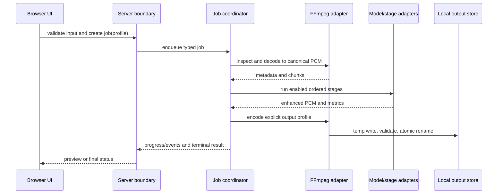
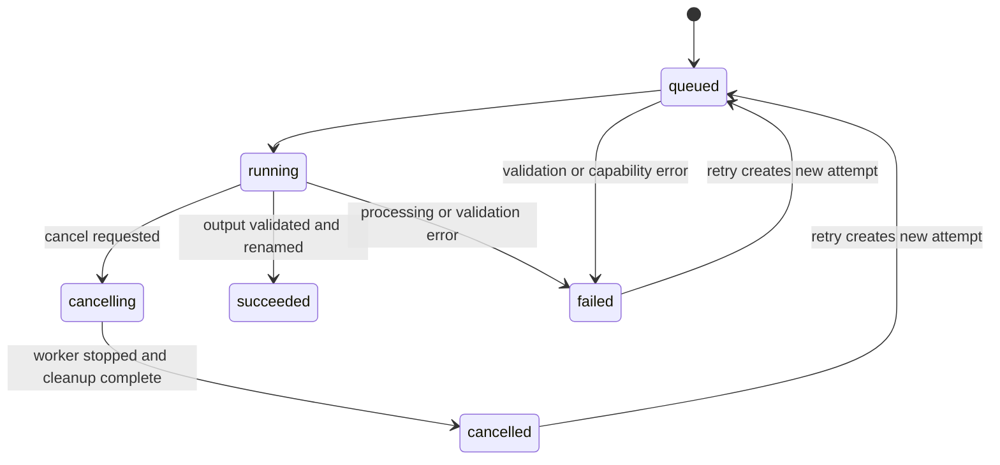

# Implementation Contract

This companion turns the kernel into the minimum implementation contract. It follows the adopted architecture spine; it does not replace it.

## Product surface

The local Next.js UI exposes four primary areas: intake, enhancement editor, active-job/preview feedback, and history/settings. Intake supports MP3, WAV, M4A, FLAC, MP4, MOV, and MKV. Video inputs use FFmpeg to extract the selected/default audio stream; output media is chosen through an explicit output profile rather than inferred by UI code.

The speech MVP exposes independent controls for noise removal, voice clarity, loudness normalization, and echo/reverb reduction. Each control has an enabled state, validated parameters, capability/availability state, and an accessible explanation. Defaults are explicit and reviewable. The first CPU-safe noise-removal adapter targets a DeepFilterNet2-derived ONNX model; release requires median STOI improvement ≥0.03, median SI-SDR improvement ≥3 dB, no more than 0.10 PESQ regression on clean-speech fixtures, zero introduced clipping, and loudness within 1 LU of the configured target. The UI must show local-only processing, model/FFmpeg availability, storage health, and output overwrite warnings.

## Boundary contracts

Shared Zod schemas define at minimum:

- `MediaMetadata`: branded source reference, media kind, format, duration, byte size, audio stream metadata, and validation result.
- `ProcessingProfile`: profile ID, ordered stage list, per-stage enabled state and parameters, model IDs/versions, and output profile.
- `Job`: branded job/run IDs, immutable input metadata, normalized profile, timestamps, lifecycle state, progress, retry linkage, and terminal result.
- `JobEvent`: job ID, sequence, timestamp, phase, progress, user-safe message, and diagnostic code.
- `TerminalResult`: status, output artifact metadata when successful, metrics, error envelope when not successful, and cleanup summary.
- `Capabilities`: OS/architecture, FFmpeg/model availability, acceleration providers, writable paths, disk-space status, and browser feature support.
- `ErrorEnvelope`: stable code, user-safe message, request ID, job ID when available, and non-sensitive diagnostic context.

API responses use `{ data, error, requestId }`. Runtime validation occurs at API and persistence boundaries. UI code cannot import FFmpeg, ONNX Runtime, or filesystem primitives.

## Job and processing flow

The coordinator validates the profile before enqueueing, owns cancellation, emits monotonic progress events, and cleans isolated temporary data on terminal completion and startup. A retry is a new attempt linked to the prior job. A startup scan reconciles interrupted jobs to `failed` or `cancelled` with a recoverable reason.

## State and failure rules

Stable error codes include `UNSUPPORTED_MEDIA`, `MODEL_UNAVAILABLE`, `DISK_SPACE_LOW`, `CANCELLED`, and `PROCESSING_FAILED`. No cancelled or failed run may expose a successful output artifact. Disk errors, missing models, unsupported streams, corrupt inputs, and output validation failures must be visible in history and logs without exposing media content.

## Adapter and stage rules

The media adapter is responsible for probing, stream selection, decode, encode, and final media validation. The canonical internal representation makes sample rate, channel layout, sample format, duration, and chunk boundaries explicit.

Each stage declares its input/output format, parameters schema, capability requirements, cancellation behavior, version, and metrics. The coordinator runs a validated ordered list; disabled stages are omitted. Deterministic loudness normalization is a stage, not a hidden encoder side effect. Model adapters isolate tensor shapes, sample-rate assumptions, provider selection, and postprocessing. CPU is the baseline provider.

## Preview, history, and privacy

Preview is a bounded derived artifact using the same normalized profile and stage order as final processing. It is labeled as preview and cannot satisfy final-output success. History is local and append/update-only through coordinator commands. Structured logs include request/job IDs and timings, never media bytes, raw audio, complete file contents, or secrets. Cleanup controls are explicit and must not delete the immutable source.

Default audio output is 48 kHz WAV PCM 24-bit, with FLAC, MP3 192 kbps, and M4A/AAC 192 kbps alternatives. Video output preserves the source container and video streams when possible and replaces the selected audio with AAC 192 kbps; MP4 with H.264/AAC is the fallback when required by the output profile. Successful outputs remain until user removal, previews older than 7 days are eligible for automatic cleanup, and history metadata remains until user-cleared. File System Access API destination selection/reveal is preferred; unsupported browsers use save/download plus Copy output path.

## Verification contract

- Unit tests cover profile validation, stage ordering, job state transitions, cancellation races, retry linkage, error mapping, cleanup, and atomic-output rules.
- Adapter integration tests use representative fixtures for every supported input format, video audio extraction, malformed media, missing model, disk failure, and final media validation.
- End-to-end browser tests cover intake, independent controls, preview labeling, progress, cancellation, retry, history, restart reconciliation, and keyboard/screen-reader-visible status behavior.
- Cross-platform diagnostics verify FFmpeg, model artifacts, writable storage, disk space, architecture, and optional accelerators; at least the CPU-safe path is demonstrable on Windows, macOS, and Linux.
- Quality gates compare speech fixtures before/after for intelligibility, noise reduction, loudness behavior, and artifact regression. Model selection remains open until these gates and license review are complete.
